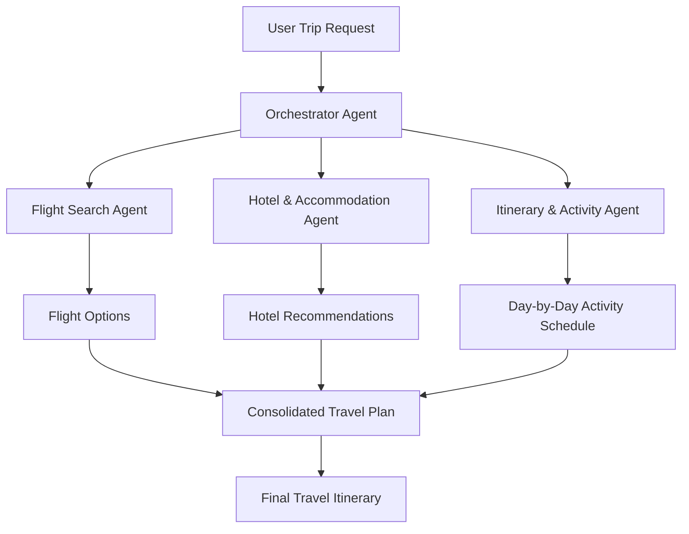

# 🌍 MakeMyTripAI

> **A Smart Multi-Agent Travel Planner AI**  
> Turn simple natural language trip requests into comprehensive, practical, and personalized travel itineraries featuring flight suggestions, hotel recommendations, and day-by-day activity schedules.

---

[](https://www.python.org/)
[](LICENSE)
[](#-architecture--workflow)

---

## 📌 Overview

**MakeMyTripAI** simplifies trip planning by harnessing specialized AI agents that collaborate to research, organize, and assemble custom travel plans. Instead of spending hours juggling multiple browser tabs for flights, hotel reviews, and local sights, users can simply state their travel goals in plain text.

---

## ✨ Key Features

- 🤖 **Multi-Agent Orchestration**: Autonomous specialized agents handle flight discovery, accommodation research, and activity scheduling concurrently.
- ✈️ **Flight & Transport Insights**: Curated flight options tailored to your origin, destination, schedule, and travel preferences.
- 🏨 **Hotel & Stay Recommendations**: Smart recommendations matching desired comfort, location proximity, and budget.
- 🗓️ **Day-by-Day Detailed Itineraries**: Interactive breakdowns featuring sightseeing, local culinary spots, and transportation tips.
- 💬 **Natural Language Interface**: Input travel prompts naturally (e.g., *"7-day family trip to Tokyo in autumn under $4000"*).
- 💰 **Budget & Preference Aware**: Tailors suggestions according to budget constraints, dietary preferences, and activity interests.

---

## 🏗️ Architecture & Workflow



---

## 🚀 Getting Started

### Prerequisites

- **Python**: Version `3.10` or higher
- **Git**: Installed on your machine
- **API Keys**: OpenAI / Gemini / Serper / Amadeus API keys (depending on active tools)

---

### Installation

1. **Clone the Repository**
   ```bash
   git clone https://github.com/skrish35/MakeMyTripAI.git
   cd MakeMyTripAI
   ```

2. **Create a Virtual Environment**
   ```bash
   python3 -m venv .venv
   ```

3. **Activate the Virtual Environment**
   - **macOS / Linux**:
     ```bash
     source .venv/bin/activate
     ```
   - **Windows (Command Prompt / PowerShell)**:
     ```cmd
     .venv\Scripts\activate
     ```

4. **Install Dependencies**
   ```bash
   pip install -r requirements.txt
   ```

---

## ⚙️ Environment Configuration

Create a `.env` file in the project root directory and add your required API keys:

```env
# AI Model Provider Keys
OPENAI_API_KEY=your_openai_api_key_here
# GEMINI_API_KEY=your_gemini_api_key_here

# Search & Travel Tool API Keys
SERPER_API_KEY=your_serper_api_key_here
AMADEUS_CLIENT_ID=your_amadeus_client_id_here
AMADEUS_CLIENT_SECRET=your_amadeus_client_secret_here
```

---

## 🖥️ Usage

Run the main application:

```bash
python main.py
```

*Or, if using a web interface (e.g., Streamlit / FastAPI):*

```bash
streamlit run app.py
```

---

## 📁 Project Structure

```text
MakeMyTripAI/
├── agents/             # Multi-agent definitions (Flight, Hotel, Itinerary)
├── config/             # Agent prompts & system configurations
├── tools/              # Custom search and API integrations
├── app.py              # Main user interface / entry point
├── requirements.txt    # Project Python dependencies
├── .env.example        # Environment variables template
├── README.md           # Project documentation
└── LICENSE             # MIT License file
```

---

## 🤝 Contributing

Contributions, issues, and feature requests are welcome! Feel free to open an issue or submit a pull request.

1. Fork the repository
2. Create your feature branch (`git checkout -b feature/AmazingFeature`)
3. Commit your changes (`git commit -m 'Add some AmazingFeature'`)
4. Push to the branch (`git push origin feature/AmazingFeature`)
5. Open a Pull Request

---

## 📄 License

Distributed under the MIT License. See [`LICENSE`](LICENSE) for more information.


